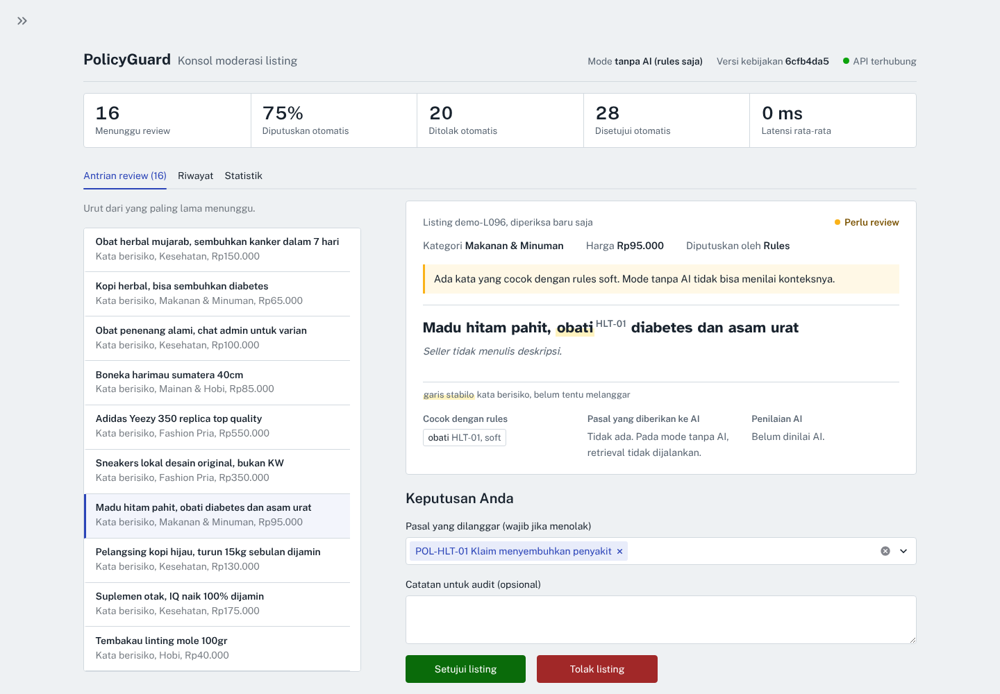
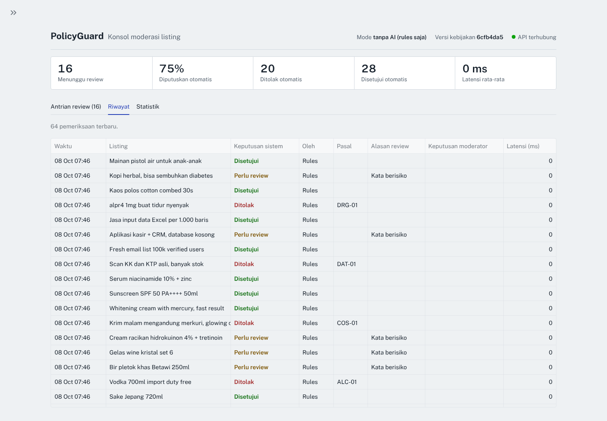
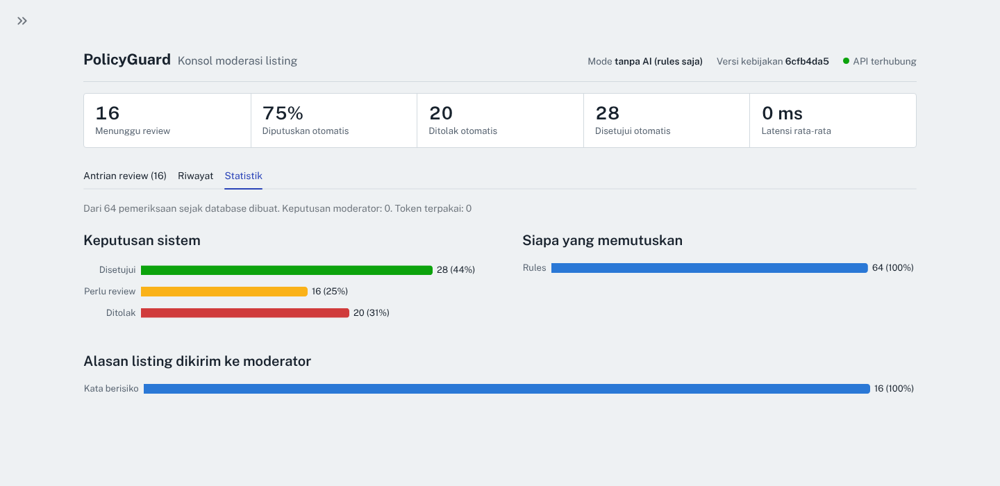

# PolicyGuard

Internal service yang memeriksa listing produk marketplace terhadap dokumen kebijakan, lalu memutuskan **approve**, **reject** (dengan pasal dan kutipan bukti), atau **needs_review** (dikirim ke moderator).

Project portfolio. Semua data dan kebijakan bersifat fiktif/sintetis; lihat [dataset card](docs/dataset_card.md).

## Masalah

Review manual tidak mengikuti volume listing, sedangkan filter keyword tidak memahami konteks ("pistol air mainan" ditolak) dan mudah diakali ("alpr4", "mirror quality"). Kebijakan juga berubah, sehingga daftar keyword dan classifier ML harus terus diperbarui. Detail: [problem statement](docs/problem_statement.md).

## Cara kerja

```text
Sistem listing ──► POST /v1/checks ──► validasi (422 jika tidak valid)
                                          │
                        idempotensi / cache (PostgreSQL)
                                          │
                          rule prefilter (teks penuh, ternormalisasi)
                          ├─ hard hit ──► reject (tanpa LLM)
                          ▼
                 retrieval top-k pasal (embedding, indeks di memori)
                          ▼
            LLM judge (structured output) ──► validator (pasal & evidence harus nyata)
                          │                     └─ tidak valid ──► 1x perbaikan
                          ▼
                 decision router (tabel keputusan + threshold)
                          ▼
           approve / reject / needs_review ──► simpan ──► response
                                                   │
                     log JSON (request_id) · /metrics · dashboard moderator

Batch: POST /v1/batches ──► Redis list ──► worker (pipeline yang sama)
```

Prinsip utama:
- **Fail-safe:** komponen gagal (LLM, retrieval) → `needs_review`, tidak pernah auto-approve.
- **AI memberi pendapat, kode memutuskan:** output LLM divalidasi secara deterministik; keputusan akhir diambil tabel keputusan dengan threshold yang bisa diatur.
- **Setiap keputusan bisa diaudit:** pasal, kutipan bukti, versi kebijakan/prompt/model, token, dan latency disimpan.

Desain lengkap: [system design](docs/system_design.md) · [decision log (18 ADR)](docs/decision_log.md)

## Menjalankan secara lokal (tanpa Docker, tanpa API key)

Butuh Python 3.11+. Langkah lengkap (VS Code, Windows, macOS/Linux) ada di [RUNBOOK.md](RUNBOOK.md). Di VS Code: pilih **PolicyGuard: API + Dashboard** di panel Run and Debug, lalu tekan F5.

```
python -m pip install -r requirements-dev.txt
python -m pytest -q
python scripts/make_env.py local
python scripts/run_local.py
```
Lalu di terminal kedua:
```
python scripts/smoke_test_api.py
```
API di http://localhost:8000 (dokumentasi: `/docs`), dashboard moderator di http://localhost:8501.

Mode LLM: `python scripts/make_env.py local --ai` (meminta OPENAI_API_KEY).

## Menjalankan dengan Docker Compose

```
python scripts/make_env.py docker --ai
docker compose up --build
```

## Konsol moderator

Moderator melihat listing seperti berkas yang sedang diperiksa: bagian yang ditandai sistem diberi stabilo dengan nomor pasal di sebelahnya. Teks listing memakai Atkinson Hyperlegible, font yang dirancang untuk membedakan `0/O` dan `1/l/I`, sehingga plesetan seperti `alpr4` atau `b0k3p` mudah dikenali.



| Riwayat keputusan | Statistik |
|---|---|
|  |  |

Screenshot dari mode `rules_only` dengan 60 listing dev set. Font: Public Sans dan Atkinson Hyperlegible (SIL Open Font License), disertakan di `dashboard/static/fonts`.

## Deploy (latihan, gratis)

`render.yaml` + `Dockerfile.render` men-deploy satu service di Render free tier: API dan dashboard dalam satu container, API hanya bisa diakses dari dalam container, dashboard dikunci password, mode `rules_only`, data contoh diisi ulang setiap server bangun. Langkahnya di [RUNBOOK.md](RUNBOOK.md) Tahap 14; alasan desainnya di ADR-019.

## API

| Endpoint | Fungsi |
|---|---|
| `POST /v1/checks` | Periksa satu listing (sync) |
| `GET /v1/checks?decision=needs_review&unreviewed=true` | Antrian moderator |
| `GET /v1/checks/{id}` | Detail, termasuk jejak AI |
| `POST /v1/checks/{id}/review` | Keputusan moderator |
| `POST /v1/batches`, `GET /v1/batches/{id}` | Pemeriksaan banyak listing (async) |
| `GET /v1/checks?order=newest` | Riwayat, termasuk keputusan moderator |
| `GET /v1/policies` | Daftar pasal kebijakan |
| `GET /v1/stats` | Ringkasan untuk dashboard |
| `GET /health`, `GET /metrics` | Operasional |

Semua endpoint `/v1` membutuhkan header `X-API-Key`.

## Evaluasi

Dataset: 250 listing berlabel (140 melanggar, 110 patuh, 15 pasal), dibagi dev (101) / test (147) per group dan per pasal.

```bash
python -m ai.evaluation.run_eval --split dev --mode rules_only
python -m ai.evaluation.run_eval --split dev --mode llm_all --price-in <USD/1M> --price-out <USD/1M>
python -m ai.evaluation.run_eval --split dev --mode llm_rag --price-in <USD/1M> --price-out <USD/1M>
python -m ai.evaluation.run_eval --split test --mode llm_rag --final     # sekali, setelah label direview
```

| Mode | Recall pelanggaran | Precision reject | Automation | Status |
|---|---|---|---|---|
| rules_only (dev) | 0.667 | 1.0* | 0.822 | [hasil](docs/eval_rules_only_dev.md) |
| llm_all (dev) | – | – | – | belum dijalankan |
| llm_rag (dev) | – | – | – | belum dijalankan |
| llm_rag (test, final) | – | – | – | belum dijalankan; label test belum direview |

\* Optimis: rules ditulis sambil mengetahui dataset.

## Status pengujian

| Bagian | Status |
|---|---|
| Logika pipeline, validator, router, rules | Unit test |
| API, idempotensi, cache, 401/422/503 | Test (SQLite) + uji manual dengan PostgreSQL 16 |
| Batch + worker | Test (fakeredis) + uji manual dengan Redis dan worker sebagai proses terpisah |
| Integrasi OpenAI (format request/response, error) | Test terhadap server tiruan, **bukan** API asli |
| Kualitas keputusan LLM | **Belum diukur** |
| Docker image / compose / `Dockerfile.render` | **Belum di-build** (akses Docker Hub tidak tersedia saat dibuat). Script start deploy diuji tanpa Docker dengan konfigurasi yang sama |
| Dashboard Streamlit | Diuji di browser (Chromium, lebar desktop dan HP): antrian, setujui, tolak, riwayat, statistik |

## Struktur

```text
ai/          pipeline AI (tanpa FastAPI): rules, retrieval, llm, validator, router, evaluasi
app/         FastAPI: api, services, db, schemas, core (config, logging, metrics)
worker/      worker batch
dashboard/   UI moderator (Streamlit)
data/        kebijakan, rules, dataset evaluasi
scripts/     validasi/split dataset, smoke test API, alat review label
tests/       61 test
exercises/   latihan debugging
docs/        problem statement, design, ADR, pedoman label, dataset card
```
